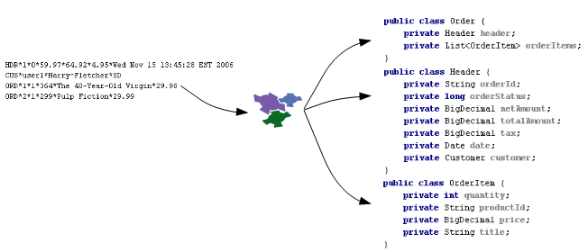
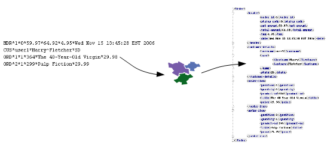
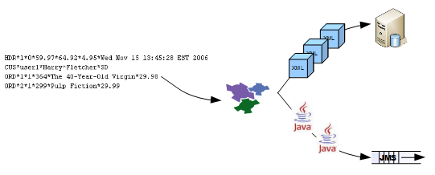
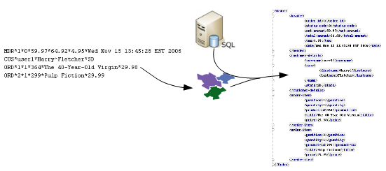

---
redirect_from:
  - /v2/
layout: default
---

:page-liquid:

++++

    

    

++++

*Smooks* is an extensible Java framework for building XML and non-XML data fragment-based applications.

The engine powering Smooks is a library with minimal dependencies that can be added to your Java project as follows:

[tabs]
====

Maven::
+
[source,xml]
----
<dependency>
    <groupId>org.smooks</groupId>
    <artifactId>smooks-core</artifactId>
    <version>2.1.0</version>
</dependency>
----
+
Gradle::
+
[source,groovy]
----
implementation group: 'org.smooks', name: 'smooks-core', version: '2.1.0'
----
+
SBT::
+
[source,scala]
----
libraryDependencies += "org.smooks" % "smooks-core" % "2.1.0"
----
====

See https://mvnrepository.com/artifact/org.smooks/smooks-core[Maven Central] for a list of available versions.

== What can it be used for?

Smooks is an extensible Java framework for building XML and non-XML data (CSV, EDI, POJOs, etc...) fragment-based applications. It can be used as a lightweight framework on which to hook your own processing logic for a wide range of data formats but, out-of-the-box, Smooks ships with features that can be used individually or seamlessly together.

=== Java Binding

Populate POJOs from a source (CSV, EDI, XML, POJOs, etc...). Populated POJOs can either be the final result of a transformation, or serve as a bridge for further transformations like what is seen in template resources which generate textual results such as XML. Additionally, Smooks supports collections (maps and lists of typed data) that can be referenced from expression languages and templates.

=== Transformation

Perform a wide range of data transformations and mappings. XML to XML, CSV to XML, EDI to XML, XML to EDI, XML to CSV, POJO to XML, POJO to EDI, POJO to CSV, etc...

=== Scalable Processing

Process huge payloads while keeping a small memory footprint. Split, transform and route fragments to JMS, filesystem, database, and other destinations.

=== Enrichment

Enrich fragments with data from a database or other data sources.

