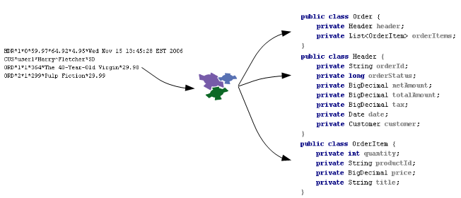

:page-liquid:

++++

    

    

++++

*Smooks* is an extensible Java framework for building XML and non-XML
data (CSV, EDI, Java, etc…) processing applications.

To use Smooks, simply add the following dependency to your project.

[source,xml]
----
<dependency>
    <groupId>org.smooks</groupId>
    <artifactId>smooks-core</artifactId>
    <version>2.0.0-M3</version>
</dependency>
----

See https://mvnrepository.com/artifact/org.milyn/milyn-smooks-all[Maven
Central] for a list of available versions.

== What can it be used for?

While Smooks can be used as a lightweight platform on which to build
your own custom processing logic (for a wide range of data formats
``out-of-the-box''), it comes with some very useful features that can be
used individually, or seamlessly combined together.

=== Java Binding

Populate a Java Object Model from a data source (CSV, EDI, XML, Java
etc). Populated object models can be used as a transformation result
itself, or can be used by (e.g.) Templating resources for generating XML
or other character based results. Also supports *Virtual Object Models*
(Maps and Lists of typed data), which can be used by EL and Templating
functionality.

=== Transformation

Perform a wide range of *Data Transforms* - XML to XML, CSV to XML, EDI
to XML, XML to EDI, XML to CSV, Java to XML, Java to EDI, Java to CSV,
Java to Java, XML to Java, EDI to Java etc.

image::assets/images/Transform.png[Transform]

=== Huge Message Processing

Process *huge messages* (GBs) - *Split*, *Transform* and *Route* message
fragments to *JMS*, *File*, *Database* etc destinations.

image::assets/images/Hugetrans.png[Huge Message Processing]

=== Message Enrichment

*Enrich* a message with data from a *Database*, or other Datasources.

image::assets/images/Enrich.png[Enrich Messages]